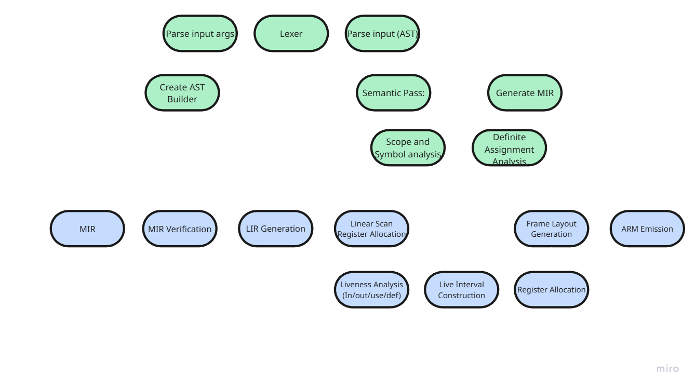

# max-- Compiler

A compiler for my own language I invented, called `max--`.

Making a simple compiler for what is essentially a small subset of C took me a much longer time than I ever could have imagined. I reached my milestone of functions compiling properly, so for all intents and purposes it is finished for now (but easily expandable).

It implements the basics:
- ints
- if/else
- while
- functions
- arithmetic expressions
- built-in print(int) function

The purpose was to teach me everything about compilers, going from a text file to an executable assembly file. Writing my own assembler or linker would have been overkill, so I use clang to assemble the generated `.s` file.

I'd love for you to try it out yourself! Unfortunately it only targets AArch64 for MacOS. It *might* work on arm Linux, but I think the runtime print call would break (different ABI).

Even this took me a month of steady work, so it's current feature set is all that will exist for a little while.

Anyone is free to do whatever they want with this project :)


## Basic setup

**THIS ONLY RUNS ON MACOS/ARM MACHINES. Doesn't support x86 or any other architecture.**

I configured everything for macOS. Theoretically should be fine on Linux machines, but
the compiler won't create any compileable code unless it's an arm linux machine.

- Run `./compile.sh`. This will build the compiler (the `bin/maxc` binary).

### Using the compiler
- First, run the maxc binary to compile your code into a .s file. Then, you can see all your print statements and the exit code using `./assm.sh`.

If you'd rather configure some stuff:
```
cmake -S . -B build
cmake --build build
```

## Basic Architecture



Above shows the basic pipeline that data flows through; it might help you sift through files and understand how things flow.

## Details and Hurdles

The frontend was written in C, and the backend in C++. There's an old legacy backend in C but doing register allocation in C sounded a bit too difficult, so I migrated everything to C++ instead. I used Linear Scan Register Allocation instead of graph colouring, mostly to save a bit of time, while still having a real register allocation algorithm, as that was part of the fun!

The hardest parts of this whole project was a few things:
1. In general, I had lots of missing information. I had to do lots of research on how compilers are structured and what a good minimal pipeline would be. I had no idea how crazy backends were, I thought the frontend was the hard part, and severely underestimated the time I would have to put into the backend.
2. Register allocation. Caused me a world of pain, requires multiple passes, all just to create a small table mapping virtual registers to physical registers. Painful but extremely satisfying when it worked!
3. I chose C as my starting language, the plan was to do the entire thing in C to be more "purist" (closer to hardware). I had minimal experience writing real C code for a big project, and I regretted this choice about 2 weeks in since C had minimal support for external data structures (vectors, tables, hash maps) as well as the fact I was inexperienced, but the frontend was already almost complete and robust enough not to bother porting to C++. The project definitely made me a much stronger C programmer though.
4. Minor headaches from previous implementation decisions, things like who owned what data and what data I needed for a specific stage of the pipeline.

The coolest parts of the project were:
1. Again, register allocation. Fascinating that it just works, and the complex machinery necessary to make it work properly.
2. The first time I saw a program run, even with arbitrary integer declarations and assignments, was great. Seeing more complicated programs like `tak` and `ack` work properly was also amazing.
3. Seeing my Abstract Syntax Tree (AST) get converted into max-- IR (MIR) was awesome. It was like my own higher level assembly language I invented, and it was great to see the generated code and how complex it got from simple rules.
4. Pratt parsing expressions was very rewarding to implement, and non-trivial to understand in my eyes. i had to spend a while reading how the algorithm is implemented so it can parse any arbitrary arithmetic expression.


## Feature Set

Currently supports:

Features:
- Int type
- Assignments
- Expressions
- Declarations
- If/else (with block)
- While loop (with block)
- Functions (in progress: works upto max-- IR generation.)

Frontend:
- Lexer
- Parser
- Scope/Symbol resolution
- Simple Intra-block linear definite assignment
- max-- intermediate representation (MIR) gen

Backend:
- MIR verification

*From here forward, the rest of the backend is in C++.*
- Lower IR generation (LIR)
- Linear scan register allocation (phew! tough one.)
- Frame Layout
- ARM emission


## (Old) Updates:

**UPDATE 2 (01/18/2026):** I am much further along. Entire backend was rewritten in C++. Working on function declarations/function calls going through entire pipeline. After this, I think I'm done for a while. Adding more features would make it more of "my own" language but I'm burnt out, I need a break from this for a little bit.

Lots of thoughts. Currently values are mutable by default but I think that's bad design; they should be immutable by default without a keyword. That wouldn't be too hard but I'm too lazy right now.

And wow. This took a lot longer than I thought. Hundreds of hours at this point for a minimal language, and I skipped some passes that verify the integrity of the code. Crazy stuff!

- Currently working on: learning about how backends work in general.
- Made an IR verification pass, frame layout pass, and LIR generation pass. Will do codegen pass, and consider doing 1-2 optimization passes later. Also will probably do register allocation at some point. Then I think I'm done with this for a bit.

- Can correctly emit ARM64 for declarations and assignments. 

Lots of fixes in the making; will refactor error handling of parsing. I chose ARM64 now instead of x86.


**UPDATE:** Scrapping my entire backend, it sucks. Going to rewrite the whole thing in C++. Oh well!

**UPDATE:** I am not bootstrapping this anymore. It's too much work. I just want to ship a really minimal language that compiles successfully at this point. Might bootstrap one day later.

I don't know if I can bootstrap. I chose to implement the backend myself. What a world of pain I was not ready for. Had I used LLVM
maybe bootstrapping was feasible but now I'm not so sure. max-1 might be it for this. :(

